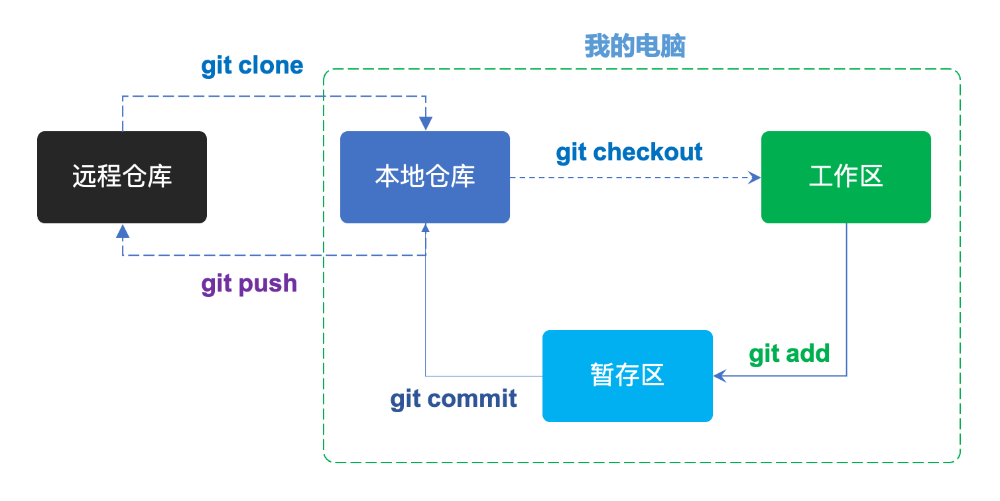

<!--idoc:ignore:start-->
入门备忘清单
===
<!--idoc:ignore:end-->


<!--rehype:style= max-width: 660px; margin: 0 auto;-->

## 创建存储库

```bash
# 创建一个新的本地存储库
$ git init [项目名称]

# 克隆存储库
$ git clone <git仓库url地址>

# 将存储库克隆到指定目录
$ git clone <git仓库url地址> <我的文件夹>
```

## 配置

```bash
# 设置将附加到您的提交(commit)和标签(tags)的名称
$ git config --global user.name "name"

# 设置将附加到您的提交(commit)和标签(tags)的电子邮件地址
$ git config --global user.email "email"

# 启用 Git 输出的一些着色
$ git config --global color.ui auto

# 在文本编辑器中编辑全局配置文件
$ git config --global --edit
```

## 变更

```bash
# 在工作目录中显示修改后的文件，为您的下一次提交暂存
$ git status

# 暂存文件，准备提交
$ git add [file]

# 暂存所有更改的文件，准备提交
$ git add .

# 将所有暂存文件提交到版本化历史记录
$ git commit -m "commit message"

# 将所有跟踪的文件提交到版本化历史记录
$ git commit -am "commit message"

# 取消暂存文件，保留文件更改
$ git reset [file]

# 将所有内容恢复到最后一次提交
$ git reset --hard

# 已更改但未暂存（staged）的内容的差异
$ git diff

# 已暂存（staged）但尚未提交的内容的差异
$ git diff --staged

# 在指定之前应用当前分支的任何提交
$ git rebase [branch]
```

## 分支

```bash
# 列出所有本地分支
$ git branch

# 列出所有分支，本地和远程
$ git branch -av

# 切换到 my_branch，并更新工作目录
$ git checkout my_branch

# 创建一个名为 new_branch 的新分支
$ git checkout -b new_branch

# 删除名为 my_branch 的分支
$ git branch -d my_branch

# 将 branchA 分支合并到 branchB 分之上
$ git checkout branchB
$ git merge branchA

# 标记当前提交
$ git tag my_tag

# 重命名为 new_name
$ git branch -m <new_name>

# 推送和重置
$ git push origin -u <new_name>

# 删除远程分支
$ git push origin --delete <old>
```

## 观察存储库

```bash
# 显示当前活动分支的提交历史
$ git log

# 显示 branchA 上不在 branchB 上的提交
$ git log branchB..branchA

# 显示更改文件的提交，即使重命名
$ git log --follow [file]

# 显示 branchA 中的内容与 branchB 中的差异
$ git diff branchB...branchA

# 在 Git 中以 人类可读 格式显示任何对象
$ git show [SHA]

# 按内容搜索更改
$ git log -S'<a term in the source>'

# 显示特定文件随时间的变化
$ git log -p <file_name>

# 打印出很酷的日志可视化
$ git log --pretty=oneline --graph --decorate --all
```

## 同步

```bash
# 从该 Git 远程获取所有分支
$ git fetch [alias]

# 将远程分支合并到当前分支以使其保持最新状态
$ git merge [alias]/[branch]
  No fast-forward
$ git merge --no-ff [alias]/[branch]
  Only fast-forward
$ git merge --ff-only [alias]/[branch]

# 将本地分支提交传输到远程存储库分支
$ git push [alias] [branch]

# 从跟踪远程分支获取并合并任何提交
$ git pull

# 将另一个分支的一个特定提交合并到当前分支
$ git cherry-pick [commit_id]
```

## 远程

```bash
# 添加一个 git URL 作为别名(alias)
$ git remote add [alias] [url]

# 显示您设置的远程存储库的名称
$ git remote

# 显示远程存储库的名称和 URL
$ git remote -v

# 删除远程存储库
$ git remote rm [remote repo name]

# 更改 git repo 的 URL
$ git remote set-url origin [git_url]
```

## 临时提交

```bash
# 保存已修改和分阶段的更改
$ git stash

# 列出隐藏文件更改的堆栈顺序
$ git stash list

# 从存储堆栈顶部编写工作
$ git stash pop

# 丢弃存储堆栈顶部的更改
$ git stash drop
```

## 跟踪路径更改

```bash
# 从项目中删除文件并暂存删除以进行提交
$ git rm [file]

# 更改现有文件路径并暂存移动
$ git mv [existing-path] [new-path]

# 显示所有提交日志，并指示任何移动的路径
$ git log --stat -M
```

## 忽略文件

`.gitignore` 文件指定了 Git 应该忽略的故意未跟踪的文件

```bash
/logs/*

# "!" 意思是不要忽视
!logs/.gitkeep

# 忽略 Mac 系统文件
.DS_store

# 忽略 node_modules 文件夹
node_modules

# 忽略 SASS 配置文件
.sass-cache
```

## 分支

```bash
# 列出所有分支及其上游
$ git branch -vv 

# 快速切换到上一个分支
$ git checkout -

# 只获取远程分支
$ git branch -r

# 从另一个分支签出单个文件
$ git checkout <branch> -- <file>
```